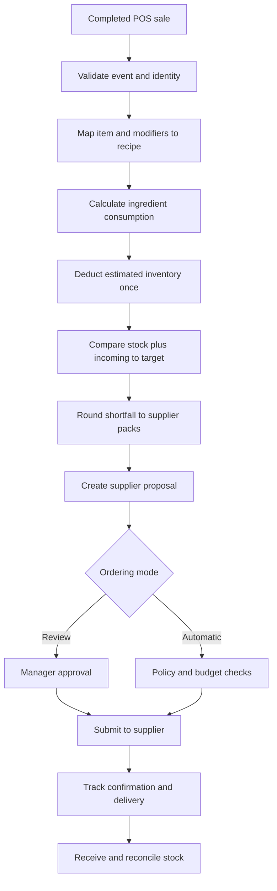

# Pantrack Development Milestones

Version: 1.1
Updated: 2026-09-19
Purpose: Working specification for developing Pantrack with Codex in VS Code
Product goal: Estimate ingredient inventory from completed menu-item sales, calculate replenishment to manager-defined target levels, and safely submit supplier orders with minimal manual work.

## 1. Product outcome

Pantrack should let each business:

1. Create a company workspace with isolated users, products, recipes, register settings, suppliers, and orders.
2. Record an opening physical inventory count for every ingredient.
3. Connect a POS system or import completed sales.
4. Convert each sold menu item into ingredient consumption using recipes and modifiers.
5. Subtract calculated consumption from estimated inventory without double counting sales.
6. Calculate the amount required to reach a manager-defined target stock level, considering confirmed incoming deliveries and supplier pack sizes.
7. Create a purchasing proposal grouped by supplier.
8. Submit approved proposals to real suppliers and track uncertain, rejected, accepted, partially fulfilled, and delivered orders.
9. Run scheduled checks automatically with budgets, limits, alerts, audit records, and an emergency pause control.

The system is an inventory estimate. Physical counts remain necessary for reconciliation because spills, over-pouring, theft, spoilage, unrecorded extras, and incorrect recipes cannot always be inferred from register data.

## 2. Current baseline

The existing prototype already contains:

- Company workspaces and access checks.
- Product catalog and supplier/SKU/pack information.
- Prepared orders and removable unsent order history.
- Inventory setup, opening counts, usage, waste, receipts, and incoming stock.
- Recipe definitions and manual sales imports.
- Manager-defined target stock and supplier-pack rounding.
- Purchasing recommendations.
- Generic vendor-connection and purchasing-control framework.
- Company-specific POS selection.
- Register-item-to-recipe mappings.
- CSV sales preview and import.
- Authenticated company sales-ingestion endpoint with duplicate protection.
- Clover OAuth authorization and menu loading code.
- Payment-method interface with incomplete live configuration.

The prototype does not yet prove:

- Real Supabase email confirmation, login, and recovery against a configured development project.
- Live Clover order synchronization.
- Complete modifier, cancellation, refund, and remake handling.
- A native connection for every POS provider listed in the interface.
- A working adapter for a real supplier.
- A provisioned background scheduler.
- Live payment configuration.
- Production monitoring, backup/recovery, or security readiness.
- A complete sale-to-delivery test with a real café, register, and supplier.

Treat every external integration as unverified until it passes its sandbox and pilot acceptance tests.

## 3. Non-negotiable engineering rules

- Keep `main` releasable. When one person is working, use focused commits directly
  on `main` if that remains the repository owner's preference. When two or more
  people are working concurrently, each person must use a separate checkout or
  worktree and a short-lived workstream branch; merge reviewed, green changes
  into `main` and delete the branch afterward. This is the concurrent-work
  exception to the earlier main-only workflow; `main` remains the only
  long-lived branch.
- Do not combine unrelated UI redesigns with integration or data-model work.
- Run locally and in sandbox environments before using live accounts.
- Never place API keys, OAuth secrets, access tokens, customer data, or payment details in source control, prompts, screenshots, logs, or browser code.
- Keep company data isolated in every query and mutation. Every company-owned record must be scoped by company ID and authorization.
- Require server-side role checks for owner and manager actions. Hiding a button is not authorization.
- Use idempotency for sales imports, webhooks, scheduled jobs, and supplier orders.
- Never silently discard an unknown POS item, modifier, ingredient, supplier product, or delivery change. Hold it for review and display the reason.
- Do not automatically restore ingredients because a financial refund occurred. Determine whether the item was prepared.
- Treat an unknown supplier-order response as unresolved. Do not retry a purchase until its status is reconciled.
- Keep automatic ordering disabled until reviewed-mode pilot acceptance is complete.
- Add schema changes through new migrations. Do not rewrite migrations already used in a deployed environment.
- Preserve audit records for inventory changes, sales imports, settings changes, proposals, approvals, submissions, failures, and delivery reconciliation.
- Use decimal-safe quantities and documented units. Money must remain integer cents or another exact representation.
- Add focused tests for authorization, idempotency, calculations, retries, and failure states. Avoid tests that only mirror implementation details.
- Do not change the live site or production data while completing local milestones unless the task explicitly authorizes a production deployment.

## 4. Core data flow



## 5. Milestone roadmap

| ID | Milestone | Depends on | Completion result |
|---|---|---|---|
| M0 | Local development baseline | None | The imported project runs safely in VS Code with a local database and tests |
| M1 | Repository quality and CI | M0 | Every pull request receives repeatable type, build, migration, and test checks |
| M2 | Independent authentication and company RBAC | M0–M1 | Users can securely sign in outside the original hosting environment |
| M3 | Inventory and recipe integrity | M1–M2 | Units, recipes, counts, and target calculations are reliable and auditable |
| M4 | POS ingestion foundation | M2–M3 | A provider-neutral sales-event pipeline handles retries and exceptions |
| M5 | Clover end-to-end pilot | M4 | Clover completed sales deduct inventory correctly in sandbox and pilot mode |
| M6 | Additional POS adapter framework | M4–M5 | A second POS proves that integrations share one stable internal contract |
| M7 | Replenishment and purchasing proposals | M3–M5 | Shortfalls produce explainable, safe proposals grouped by supplier |
| M8 | First real supplier adapter | M7 | One supplier can quote, accept, reconcile, and confirm a real test order |
| M9 | Scheduler, alerts, and operations | M5–M8 | Background work runs reliably with visible health and failure recovery |
| M10 | Payments and financial controls | M2, M8 | Payment responsibilities and limits are secure and explicitly defined |
| M11 | Pilot validation and controlled automation | M0–M10 | One business completes a measured sale-to-delivery pilot |
| M12 | Multi-company production readiness | M11 | The system can onboard additional businesses safely and supportably |

---

## 5.1 Three-person parallel delivery plan

The milestone dependencies above are **acceptance gates**, not a requirement for
everyone to wait before doing design, fixtures, pure logic, adapter shells, or
tests. A downstream milestone cannot be marked complete or enabled against a
real service until its prerequisites are accepted, but preparatory work may be
developed against versioned internal contracts and fakes.

Use these three long-lived areas of responsibility. “Person A/B/C” identifies a
role, not a specific individual; record the actual names at the start of a work
cycle. The person doing a task reviews their own work. A different contributor's
review is not required to complete a development checklist item; contract tests,
the migration queue, milestone evidence, and explicit real-world approvals remain
required.

| Workstream | Primary ownership | Milestones/slices | First work that can start now |
|---|---|---|---|
| **A — Inventory and replenishment domain** | Units, conversions, recipe versions, counts, inventory events, proposal calculations and frozen proposal inputs | M3 and M7; inventory accuracy and proposal evidence in M11; data-lifecycle portions of M12 | Write the M3 unit/precision and recipe-version design, acceptance fixtures, pure conversion/calculation code, and additive migration plan. After the M3 contract is stable, build M7 calculation/snapshot logic in review-only mode while POS inputs are represented by fixtures. |
| **B — Sales ingestion and POS adapters** | Provider-neutral sales events, held/replay workflow, Clover, the selected second POS, and integration health | M4–M6; sales completeness and held-event evidence in M11; ingestion isolation/rate-limit portions of M12 | Define the M4 event/state-machine contract and contract tests using a fake inventory-consumption port. Implement durable receipt and exception handling that does not depend on a real Clover account. Integrate with A's inventory service only after its consumption contract is published. |
| **C — Platform, supplier, and operations** | M2 acceptance/deployment repair, supplier ordering, scheduling/alerts, payment controls, and release operations | Remaining M2 acceptance, M8–M10; order/alert/pause evidence in M11; operations/security/release portions of M12 | Diagnose the Cloudflare build and complete the real Supabase/review checklist. In parallel, collect the external M5/M6/M8–M10 decisions, define supplier and scheduler interfaces, and build timeout/budget/lease tests against fakes. Do not submit an order or enable a schedule. |

This assignment deliberately gives one person end-to-end ownership of each
high-risk boundary. A owns quantity truth, B owns sales-event truth, and C owns
external purchasing side effects. Code should cross those boundaries only
through the contracts below.

### Contract handoffs

1. **A → B: inventory consumption.** A publishes the exact unit/decimal policy,
   recipe-version lookup rules, opening-count cutoff behavior, and an atomic,
   idempotent consumption request/result contract. B may receive, validate, and
   hold events before this is ready, but must not write inventory directly.
2. **B → A: sales readiness.** B publishes the provider-neutral event identity,
   application status, held reason, event time, mapped recipe/modifier identity,
   and connection-health contract. A may test proposal math with fixtures before
   this handoff; final M7 acceptance waits for M5's reliable inputs.
3. **A → C: purchasing proposal.** A publishes an immutable proposal snapshot
   with versions, quantities, supplier SKU/pack data, limits, warnings, and an
   explanation. C owns state beginning with external quote/submission and must
   never recalculate A's inventory shortfall inside a supplier adapter.
4. **B/C → operations.** B exposes idempotent sync/reconciliation jobs and C
   exposes idempotent supplier/proposal jobs. C owns scheduling, leases, retry
   policy, alerts, and operational status; scheduled code calls the same service
   entry points used by manual actions.

Put shared TypeScript contract types in small, dependency-light modules. Add
contract tests before integrating the implementations. A contract change that
affects another workstream requires a documented handoff and passing consumer
contract tests. The implementer self-reviews the change; another workstream's
sign-off is not a development gate.

### Parallel execution waves

| Wave | Person A | Person B | Person C | Exit/checkpoint |
|---|---|---|---|---|
| **0 — unblock and specify** | M3 design, fixtures, tests, pure quantity logic | M4 event contract, state machine, fixtures, fake consumption port | M2 provider/deployment acceptance; external-service decisions and fake adapter contracts | M2 is accepted; A/B consumption contract is published and contract-tested; no production or purchase action occurred. |
| **1 — build independent cores** | Complete M3, then build M7 calculator and snapshot behind review mode | Build M4 receipt/hold/replay; then integrate the published M3 consumption port | Build supplier timeout/idempotency, job/lease, alert, and budget components against fakes | M3 then M4 accepted in order; shared contracts have versioned tests. |
| **2 — integrate real sandboxes** | Finish M7 integration once M5 inputs are reliable | Complete M5 Clover evidence, then the selected M6 adapter | Complete M8, then M9 and M10 as their gates become available | M5 precedes final M7 acceptance; M7 precedes real M8; no automatic purchasing. |
| **3 — pilot and release** | Own inventory/proposal measurements | Own POS completeness and held-event recovery | Own orders, alerts, pause controls, and evidence coordination | All three execute M11 together. Split M12 as listed below only after M11 exit evidence is accepted. |

Work may move forward within a row, but milestone completion claims must still
follow the dependency table. If an external account is unavailable, continue
with local contract/failure tests and clearly leave sandbox acceptance blocked.

### Step-by-step checklist for each person

At the start of the project, replace the blanks below with names and keep the
role assignment stable through M11 unless the handoff is recorded in this file:

```text
Person A — Inventory and replenishment: ____________________
Person B — Sales ingestion and POS:     ____________________
Person C — Platform and purchasing:     ____________________
Current merge owner:                    ____________________
```

For every numbered item, the assigned person follows the same delivery loop:

1. Update from `main`, confirm the prerequisite and acceptance gate, and create
   the short-lived workstream branch/worktree.
2. Re-read the affected milestone, contract handoff, and current-status entry.
   List shared files, migrations, external access, and consumer contract tests
   that the slice needs.
3. Add or update the contract and focused acceptance tests before connecting a
   real provider or changing user-visible behavior.
4. Implement only that numbered slice. Keep incomplete external behavior behind
   review-only or disabled gates.
5. Run focused tests plus typecheck, migration check when applicable, and build.
   Rebase before finalizing any schema-bearing change.
6. Self-review the full diff and evidence, merge only when required checks are
   green, and give the next person the contract, test, migration, and rollback
   notes. No separate development reviewer is required.
7. Update the checklist and milestone evidence. A locally completed slice may be
   checked here while its milestone acceptance remains explicitly blocked on a
   later sandbox, external action, or prerequisite.

#### Person A — Inventory and replenishment sequence

- [x] **A1 — Specify M3.** Write the unit/precision, conversion, recipe-version,
  modifier, opening-count cutoff, and physical-count reconciliation decisions.
  Identify how existing inventory and recipe data migrates without rewriting
  history. **Output:** accepted design note and migration plan.
- [x] **A2 — Publish the A → B consumption contract.** Define the atomic,
  idempotent consumption request/result, recipe-version selection, decimal/unit
  errors, and pre-opening-count result. Publish it for Person B's consumer tests. **Output:** small
  shared type module, fake, and contract tests; this unblocks B's M4 application
  work.
- [x] **A3 — Add M3 data foundations.** Through the migration queue, add the
  additive unit, conversion, recipe-version/modifier, count-cutoff, and
  reconciliation structures. Add compatibility tests for existing records.
  **Gate:** M2 must be accepted before M3 can be marked complete.
- [x] **A4 — Complete M3 behavior.** Implement safe unit changes, immutable
  recipe history, modifiers, sale-time recipe selection, cutoff enforcement,
  count variance/history, and decimal-safe target examples. Add the required
  manager UI and authorization/company-isolation tests.
- [x] **A5 — Accept M3 and hand off to B.** Run the full definition of done,
  record evidence for every M3 criterion, and verify through M4 contract tests
  that the published interface needs no inventory-specific workaround. **Milestone:**
  M3 complete only after M2 and all M3 evidence pass.
- [ ] **A6 — Build the independent M7 core.** Version replenishment settings;
  implement pure shortfall, incoming, whole-pack, capacity, shelf-life, stale
  count, and limit calculations; freeze explainable proposal snapshots. Use B's
  sales-health fixtures and keep everything review-only.
- [ ] **A7 — Complete M7 lifecycle and A → C handoff.** Add proposal lifecycle,
  invalidation, edit reasons, audit history, and atomic unresolved-quantity
  reservations. Publish the immutable proposal contract to Person C and test it
  against C's fake supplier consumer.
- [ ] **A8 — Accept M7.** After B supplies accepted M5 inputs, run concurrency
  and end-to-end proposal tests and record M7 evidence. **Milestone:** M7 complete
  only after M3–M5; this handoff unblocks real M8 implementation.
- [ ] **A9 — Execute A's M11 slice.** Configure approved pilot units, recipes,
  counts, targets, and pack conversions; measure inventory variance and proposal
  accuracy through two reviewed count-to-delivery cycles. Investigate variance
  through audited configuration changes.
- [ ] **A10 — Execute A's M12 slice.** Only after M11 acceptance, complete domain
  onboarding, export/deletion data behavior, and backup/restore validation. Give
  the merge owner evidence for the combined M12 release report.

#### Person B — Sales ingestion and POS sequence

- [x] **B1 — Specify M4.** Define provider-neutral event identity and schema,
  receipt/application states, held reasons, payload retention/redaction, and the
  cancellation/refund/remake/reopened-order consumption policy. Validate inventory
  assumptions against A2's contract. **Output:** accepted M4 design and state machine.
- [x] **B2 — Build M4 against a fake consumption port.** Add contract tests for
  duplicate and concurrent delivery, crash/retry, unknown items/modifiers,
  replay, dismissal/correction, authorization, and payload redaction. Implement
  validation and durable receipt/hold behavior without writing inventory.
- [x] **B3 — Add M4 data foundations.** Through the migration queue, add event,
  processing, held/replay, and audit structures. Keep CSV and bridge fixtures in
  the same provider-neutral contract. **Gate:** do not apply events until A2 is
  published, contract-tested, and merged.
- [x] **B4 — Integrate A's consumption contract.** Apply mapped events exactly
  once, preserve all-or-nothing ingredient deduction, enforce the opening-count
  cutoff, and implement resolve/replay/dismiss/correction UI and audit behavior.
  Local closeout: [B4 evidence](M4_B4_LOCAL_EVIDENCE.md).
- [x] **B5 — Accept M4.** After M3 acceptance, run M4 concurrency, recovery,
  authorization, and compatibility evidence. **Milestone:** M4 complete only
  after M2–M3 and all M4 evidence pass. Accepted for local development on
  2026-09-24; see [B5 evidence](M4_B5_LOCAL_EVIDENCE.md).
- [ ] **B6 — Complete M5 locally.** Finish the Clover adapter, merchant/location
  binding, menu/modifier mapping, cursor/checkpoint reconciliation, token
  lifecycle, disconnect behavior, health, and sync-now path using the M4 service.
- [ ] **B7 — Accept M5 in Clover sandbox.** With explicitly approved sandbox
  access, record normal, duplicate, modifier, refund/cancellation, refresh,
  disconnect, and missed-event recovery cases, including expected versus actual
  ingredient use. **Milestone:** M5 remains incomplete until this evidence exists.
- [ ] **B8 — Implement and accept M6.** After the product owner selects a real
  second POS, extract the stable adapter interface from accepted Clover behavior,
  add truthful capability/status states, implement the adapter, and run the same
  contract and sandbox tests. Keep CSV and bridge fallbacks supported.
- [ ] **B9 — Execute B's M11 slice.** Operate the approved pilot POS connection;
  measure completeness, lag, duplicates, held/replayed events, and recovery.
  Supply the sale-to-inventory event trail for both reviewed cycles.
- [ ] **B10 — Execute B's M12 slice.** Only after M11 acceptance, complete
  integration onboarding/status, webhook and ingestion abuse controls, and
  cross-company adapter-isolation tests. Give evidence to the merge owner.

#### Person C — Platform, supplier, and operations sequence

- [x] **C1 — Accept M2.** Diagnose and resolve the Cloudflare Worker build,
  review the additive authentication migration and flow, configure a development
  Supabase project without exposing secrets, and perform the real confirmation,
  login, invitation/roles, ownership, recovery, expiration, and logout walkthrough.
  **Owner acceptance on 2026-09-23:** the owner accepted the development-provider
  walkthrough and a contributor's replacement Cloudflare build report, then
  explicitly directed C1 to be treated as complete. No successful Cloudflare
  run/commit or separate written authentication/migration review record was
  provided. The user subsequently reported completing that review. The agent
  inspected the additive migration and auth flow and ran local checks, but
  this is not independent security or production acceptance.
- [ ] **C2 — Record M2 evidence and unblock the team.** Run the complete checks,
  document deployment limitations, and update current status only when every M2
  acceptance item has evidence. Notify A and B that M2's gate is open.
- [ ] **C3 — Obtain external decisions while A/B build.** Coordinate the Clover
  sandbox and second-POS selection needed by B. Record the first supplier,
  ordering channel, account/location/SKUs/terms, scheduler/queue, notification
  owners, retry policy, payment responsibility, limits, and alert ownership.
  Missing decisions stay explicit blockers rather than guessed defaults.
- [ ] **C4 — Build safe platform components against fakes.** Define supplier,
  scheduler/job, alert, and budget-reservation contracts. Test sending-before-call,
  idempotency, ambiguous timeout/unknown status, reconciliation, leases, bounded
  retry, terminal failure, and concurrent budgets. Do not submit or schedule real
  work; validate A's proposal snapshot through the shared contract and tests.
- [ ] **C5 — Implement and accept M8.** After A accepts M7, consume its immutable
  proposal without recalculating quantities; implement the selected supplier's
  quote, validation, submission, status, incoming-stock, and delivery behavior.
  Pass sandbox/failure tests before one separately approved low-risk real order.
- [ ] **C6 — Implement and accept M9.** After M5–M8, provision the selected
  scheduler/queue and notification channel; connect B's sync jobs and C's supplier
  jobs through their idempotent service entry points. Prove duplicate delivery,
  retry, terminal failure, alert delivery, status, and recovery with the browser
  closed.
- [ ] **C7 — Implement and accept M10.** After M8 and the payment model decision,
  finish hosted/tokenized setup where needed, owner authorization/reauthentication,
  allowlists, per-order/day/month limits, unknown-order budget reservations, and
  financial audit/reconciliation. Keep automatic purchasing disabled.
- [ ] **C8 — Coordinate M11 and execute C's slice.** Prepare the runbook and
  evidence report; operate reviewed supplier submissions, delivery reconciliation,
  alerts, and tested pause/recovery. Collect written manager sign-off before each
  stage and combine A/B/C evidence for both reviewed cycles.
- [ ] **C9 — Execute C's M12 slice and release coordination.** Only after M11
  acceptance, complete monitoring, incident/support procedures, security review,
  operational recovery, and release documentation. As merge owner or coordinator,
  combine all M12 evidence; do not mark M12 complete from C's slice alone.

### File and merge ownership

The following boundaries reduce day-to-day merge conflicts. They are defaults;
the implementer self-reviews any scoped handoff or shared-file change.

| Area | Default editor |
|---|---|
| `src/lib/inventory.ts`, `src/lib/pantry.ts`, inventory/recipe/proposal domain modules, `src/components/workspace/inventory-panel.tsx`, and focused M3/M7 tests | A |
| `src/lib/import-sales.ts`, `src/lib/register-*`, `src/lib/clover.ts`, register/sales/Clover routes and components, and focused M4–M6 tests | B |
| Authentication acceptance fixes; `src/lib/purchasing-engine.ts`, `src/lib/vendor-adapter.ts`, `src/lib/stripe-payments.ts`, automation/payment routes and components, and focused M8–M10 tests | C |
| `src/db/schema.ts`, migration journal/snapshots, shared workspace shells, package/CI scripts, and roadmap/status documents | Merge owner for the current integration window; affected contracts need tests and handoff notes |

- Prefer adding workstream-specific modules and test files over repeatedly
  editing a shared large file. Do not perform unrelated renames or formatting.
- Only one schema-bearing change enters the merge queue at a time. Rebase it on
  current `main`, generate the next additive migration, run `pnpm db:check`, and
  merge it before the next schema-bearing change is finalized. Never reserve
  migration numbers or hand-merge generated snapshots.
- Name branches by workstream and milestone, for example `workstream-a/m3-units`,
  `workstream-b/m4-events`, and `workstream-c/m2-acceptance`. Keep each branch to
  one reviewable contract or behavior change.
- Nominate a rotating merge owner for each integration window. The merge owner
  resolves shared-file conflicts, runs the complete pipeline, and updates status
  documents; this is coordination duty, not ownership of all three designs.
- Merge contract-first changes early. Rebase dependent branches immediately
  after a contract or migration lands. Feature flags/review-only gates must keep
  incomplete downstream behavior unreachable.
- Every handoff must include the contract, focused tests, migration/rollback
  notes, and which acceptance criteria remain blocked. A verbal handoff or a
  passing mocked test is not external acceptance evidence.

### Shared M11 and M12 split

M11 is a single coordinated pilot, not three independent pilots. A owns count,
recipe, variance, and proposal-accuracy evidence; B owns sale completeness,
duplicates, held/replayed events, and POS recovery; C owns supplier order and
delivery evidence, alerts, pause/recovery, and the combined evidence report.
The responsible workstream owner reviews the audit trail; manager sign-offs are
still required before advancing a stage.

After M11 passes, divide M12 without changing the architecture boundaries:

- A: onboarding for products/units/recipes/counts, export/deletion data rules,
  and backup/restore data validation.
- B: integration onboarding/status, webhook and ingestion abuse controls, and
  cross-company adapter isolation tests.
- C: production monitoring, incident/support procedures, security review,
  operational recovery, and release-readiness coordination.

The merge owner runs the full tenant-isolation and release pipeline after all
three M12 slices land. No slice alone is sufficient to mark M12 complete.

---

## M0 — Local development baseline

**Objective:** Make the repository reproducible on the developer computer without accessing production data.

### Tasks

- [x] Read the original project handoff, `package.json`, `.env.example`, authentication code, database access code, migrations, and test scripts.
- [x] Confirm the required Node and pnpm versions.
- [x] Install dependencies from the lockfile.
- [x] Configure a local Cloudflare-compatible D1 database or the supported local equivalent.
- [x] Apply all existing migrations to a new local database.
- [x] Create local-only development variables from `.env.example` using dummy or sandbox values.
- [x] Document how local authentication works. If the current host headers cannot be reproduced securely, add a clearly isolated development-only identity fixture that cannot run in production.
- [x] Run type checking, existing tests, and the production build.
- [x] Add `docs/LOCAL_DEVELOPMENT.md` with exact setup, reset, test, and run commands.
- [x] Confirm `.env`, database state, generated secrets, and dependency folders are ignored by Git.

### Acceptance criteria

- [x] A clean clone can be installed and started by following the documentation.
- [x] The home page loads locally.
- [x] A local company can be created or seeded without using production data.
- [x] Existing migrations apply in order to an empty local database.
- [x] Type checking, tests, and build complete successfully.
- [x] No real credentials or production records exist in the repository.


Implementation evidence (2026-09-18): local M0 acceptance passed on Windows with Node 22.23.2 and pnpm 11.25.0. See [M0 evidence](M0_LOCAL_EVIDENCE.md). The milestone branch was later consolidated into `main`. Production authentication and external integrations remain unverified.

### Codex prompt

> Implement M0 from `docs/PANTRACK_MILESTONES.md`. First inspect the repository and report the current local-development blockers. Then make the smallest changes required for a reproducible local setup. Do not access production services or weaken production authentication. Add `docs/LOCAL_DEVELOPMENT.md`, run the relevant checks, and show me the final diff and commands before committing.

---

## M1 — Repository quality and continuous integration

**Objective:** Make changes reviewable and prevent broken code or migrations from reaching the main branch.

### Tasks

- [x] Add clear scripts for type checking, focused tests, complete tests, build, and migration generation/checking.
- [x] Add a CI workflow for pull requests using the locked Node and pnpm versions.
- [x] Cache dependencies safely without caching secrets or local databases.
- [x] Run type checking, meaningful tests, and production build in CI.
- [x] Detect uncommitted generated migrations or schema/migration mismatch.
- [x] Add a pull-request template containing scope, schema changes, security impact, tests, screenshots when relevant, and rollback notes.
- [x] Add `CONTRIBUTING.md` with branch, commit, migration, and review conventions.

### Acceptance criteria

- [x] CI passes on the baseline main branch.
- [x] A deliberate type error fails CI.
- [x] A deliberately failing test fails CI.
- [x] A schema change without its generated migration fails or is clearly detected.
- [x] CI does not require production secrets.

Implementation evidence: all six original suites, type checks, migration checks, and production build passed. Deliberate type/test/schema failures were detected. Hosted pull-request CI passed on Ubuntu and Windows (run 35356413026), and documentation-repair commit `333dbbd` passed main CI on both systems (run 35426054567). See [M1 evidence](M1_CI_EVIDENCE.md). The milestone branch was consolidated into `main`.

### Codex prompt

> Implement M1 only. Use the existing package manager and scripts. Add a minimal CI workflow and contributor documentation. Do not deploy or change application behavior. Demonstrate that the normal pipeline passes and explain which deliberate failures it would catch.

---

## M2 — Independent authentication and company permissions

**Objective:** Replace hosting-specific identity assumptions with secure authentication suitable for the chosen deployment platform.

Implementation and local acceptance checks are recorded in [M2 evidence](M2_LOCAL_EVIDENCE.md). The implementation is on `main`, and hosted repository CI passes. The owner accepted the development Supabase walkthrough and directed C1/M2 to be treated as complete on 2026-09-23, including owner-attested acceptance of a replacement Cloudflare build. Its successful run/commit and a separate owner authentication/migration review record are unavailable; see [development auth evidence](M2_DEV_AUTH_EVIDENCE.md). Deterministic invitation, ownership, role, replay, and expiry cases are automated. This acceptance is not independent security verification, a deployment verification, or production approval.

### Product decisions approved

- [x] Choose the production authentication provider and deployment host.
- [x] Decide whether a person can belong to multiple companies.
- [x] Confirm roles: owner, manager, and employee.
- [x] Define who can invite/remove users, connect integrations, approve orders, enable automation, and view financial settings.

### Tasks

- [x] Implement verified server-side sessions.
- [x] Link authenticated users to memberships; do not trust client-provided company IDs or roles.
- [x] Add company invitations with expiration, single use, and role assignment.
- [x] Add membership management and safe ownership transfer rules.
- [x] Create a centralized authorization helper and apply it to every API route.
- [x] Add CSRF protection where cookie-based mutations require it.
- [x] Add session expiration, logout, and account-recovery behavior.
- [x] Record security-relevant membership and integration-setting changes in an audit log.

### Acceptance criteria

- [x] Anonymous requests cannot read or modify company data.
- [x] A member of Company A cannot access Company B by changing URL or request fields.
- [x] Employees cannot connect POS/vendor accounts, change automation, or view payment controls unless explicitly authorized.
- [x] Managers can perform only the actions listed in the permissions matrix.
- [x] Invitation replay and expired invitations are rejected.
- [x] Authorization tests cover every API family.

### Codex prompt

> Implement M2 using the authentication provider documented in the repository decision record. Create a permissions matrix first, then centralize authorization and migrate one API family at a time. Preserve company isolation. Add tests for anonymous access, wrong-company access, role restrictions, invitation replay, and session expiry. Do not deploy until I review the migration and authentication flow.

---

## M3 — Inventory, units, and recipe integrity

**Objective:** Ensure stock calculations remain consistent as products, units, recipes, and counts change.

### Tasks

- [x] Define supported stock units and conversion policy. Avoid silent free-text conversions.
- [x] Distinguish purchase unit, stock unit, and recipe unit.
- [x] Require an explicit conversion such as one case = 128 fl oz or one bag = 1,000 g.
- [x] Prevent incompatible unit changes while stock, incoming deliveries, or active recipes exist unless a reviewed migration is performed.
- [x] Version recipes so historical sales remain explainable after a recipe changes.
- [x] Add recipe status: draft, active, and archived.
- [x] Add modifier recipes for extra shots, milk substitutions, sizes, toppings, and other measurable changes.
- [x] Add an opening-count timestamp and reject sales that predate that cutoff.
- [x] Add reconciliation reports comparing estimated stock to physical counts.
- [x] Preserve inventory events for count corrections, use, waste, sales, receipts, and adjustments.
- [x] Explain every replenishment calculation in the UI: target, on hand, incoming, shortfall, pack conversion, limits, and final recommendation.

### Acceptance criteria

- [x] A sale uses the recipe version active for that sale/import decision.
- [x] Editing a current recipe does not rewrite historical usage records.
- [x] Incompatible units are rejected before inventory changes.
- [x] A repeated sales batch does not deduct twice.
- [x] A physical count resets or records estimation variance according to the documented rule.
- [x] Target-stock calculation passes examples involving incoming stock, case rounding, capacity, shelf life, zero target, and stale counts.

Owner-accepted for local development on 2026-09-23 after the complete local
pipeline and A5 handoff review; see [M3 evidence](M3_LOCAL_EVIDENCE.md).
The current UI explains the reviewed compatibility calculation. Versioned
proposal snapshots and policy explanations remain A6/M7 work. Hosted `0012`
migration and Worker behavior are unverified, so the exact preview stays off
remotely. M4/B5 acceptance is recorded in the section below.

### Codex prompt

> Implement M3 in small commits. Start with a unit and recipe-versioning design note and migration plan. Preserve existing inventory history. Add acceptance tests for the documented examples before changing the UI. Do not invent automatic unit conversions that the manager has not configured.

---

## M4 — Provider-neutral POS ingestion foundation

**Objective:** Create one internal sales-event model that native POS adapters and external integration services can use safely.

### Required internal event fields

- Provider and environment.
- Merchant/company mapping and location ID.
- External order ID, line-item ID, and stable event/version ID.
- Event type and event time.
- Item/variation ID and quantity.
- Modifier IDs and quantities.
- Order status and preparation/fulfillment evidence when available.
- Source payload hash and ingestion time.

### Tasks

- [x] Store raw event metadata needed for audit and replay without storing unnecessary payment or customer data.
- [x] Validate event size, schema, company mapping, provider identity, and credentials/signature for active ingress. Native POS signature verification remains B6/M5.
- [x] Use provider + merchant + event/version identity for idempotency.
- [x] Add a durable processing status: received, processing, applied, held, failed, or superseded.
- [x] Separate receipt of an event from application of inventory changes.
- [x] Add retry-safe processing and a dead-letter/held-event queue.
- [x] Add an exception screen for unmapped items, modifiers, invalid quantities, missing recipes, and events before the opening count.
- [x] Add manual resolve, replay, dismiss-with-reason, and stock-correction actions with audit records.
- [x] Define cancellation, refund, remake, and reopened-order policies based on consumption evidence.
- [x] Keep the current CSV and bridge imports compatible with the same service.

### Acceptance criteria

- [x] Duplicate delivery of the same external event changes inventory once.
- [x] Concurrent duplicates cannot both apply.
- [x] Unknown items and modifiers are held without partially deducting inventory.
- [x] Fixing a mapping allows the held event to be replayed safely.
- [x] Events before the opening-count cutoff are not applied.
- [x] A refund does not restore ingredients unless a reviewed consumption rule says it should.
- [x] Logs and stored payloads contain no access tokens or unnecessary payment/customer information.

M4/B5 is accepted for local development on 2026-09-24 after M2/M3 owner
acceptance, the [B5 local evidence](M4_B5_LOCAL_EVIDENCE.md), and green Ubuntu
and Windows CI on the B5 branch and merged `main` commit. The active sources are
manual sales, CSV, and the authenticated bridge. Native provider signatures and
Clover sandbox evidence belong to B6/B7. Hosted D1 migration `0012` and Worker
smoke remain separate gates before enabling the exact preview remotely.

### Codex prompt

> Implement M4 as a provider-neutral ingestion service. Write the event contract and state machine first. Reuse existing recipe deduction logic, but separate event receipt from inventory application. Add concurrency and duplicate tests, a held-event workflow, and audit records. Keep existing manual imports working.

---

## M5 — Clover sandbox and pilot integration

**Objective:** Convert the existing Clover authorization/menu work into reliable completed-sale synchronization.

### Tasks

- [ ] Register/configure a Clover sandbox app with the minimum required read permissions.
- [ ] Complete OAuth callback, encrypted token storage, refresh rotation, expiration, reconnect, and revocation behavior.
- [ ] Confirm merchant identity and bind it to exactly one authorized company connection.
- [ ] Import menu items, variations, and relevant modifier identifiers.
- [ ] Map Clover items/modifiers to active Pantrack recipes.
- [ ] Ingest completed/prepared Clover orders using the M4 event model.
- [ ] Add pagination/cursor checkpoints and a bounded initial-sync cutoff.
- [ ] Add webhook handling if available and polling reconciliation to recover missed events.
- [ ] Record last successful sync, last attempted sync, lag, error, and held-event count.
- [ ] Handle order changes, voids, refunds, reopened orders, and partial fulfillment according to the documented consumption policy.
- [ ] Add a connection health and “sync now” interface.

### Acceptance criteria

- [ ] OAuth state/replay tests pass and tokens never reach browser logs or source control.
- [ ] Refresh-token rotation is atomic and recoverable.
- [ ] A completed sandbox latte sale deducts the correct milk, coffee, cup, and configured modifiers exactly once.
- [ ] An unmapped Clover modifier holds the event and does not partially deduct.
- [ ] Webhook retries and reconciliation polling do not duplicate usage.
- [ ] Disconnecting stops sync while preserving historical inventory events and mappings.
- [ ] A documented sandbox test report includes event IDs, expected usage, actual usage, and resolution of exceptions.

### Codex prompt

> Implement M5 against Clover's current official sandbox documentation. Keep automatic purchasing paused. Use the M4 ingestion contract and existing mappings. Complete sandbox tests for normal sales, duplicate delivery, modifiers, cancellation/refund cases, token refresh, disconnect, and missed-event recovery. Stop and list the exact developer-console settings or credentials I must supply; never ask me to paste secrets into chat or commit them.

---

## M6 — Additional POS adapters

**Objective:** Prove that Pantrack supports multiple POS systems through adapters rather than provider-specific inventory logic.

### Tasks

- [ ] Select the second POS based on a real pilot customer, API availability, permissions, cost, and approval requirements.
- [ ] Create a provider adapter interface for authorization, locations, catalog, incremental sales, webhooks, and health.
- [ ] Keep provider payload parsing inside the adapter.
- [ ] Translate provider events into the M4 internal contract.
- [ ] Store provider capabilities so the UI does not advertise unsupported sync behavior.
- [ ] Add connection status per company/provider/location.
- [ ] Document how to add future adapters and include a contract test suite.
- [ ] Keep CSV and authenticated bridge ingestion as supported fallback paths.

### Acceptance criteria

- [ ] Clover and the second provider pass the same ingestion contract tests.
- [ ] The inventory service contains no second-provider-specific logic.
- [ ] The UI accurately labels native connection, bridge connection, CSV-only, setup required, degraded, and disconnected states.
- [ ] A provider selection alone never appears as a working connection.

### Codex prompt

> Implement M6 for the selected second POS. First extract the stable adapter interface from the working Clover integration. Add provider capabilities and contract tests. Do not add placeholder “connected” states or list unsupported providers as functional integrations.

---

## M7 — Replenishment and purchasing proposals

**Objective:** Turn reliable inventory estimates into explainable proposals without prematurely placing purchases.

### Formula

For explicit target-stock mode:

```text
stock position = on hand + confirmed incoming
shortfall = max(0, target stock - stock position)
suggested packs = ceil(shortfall / stock units per purchased pack)
```

Then apply configured capacity, shelf-life, minimum-order, order-multiple, stale-count, expiration, and policy limits. Never reduce a safety rule silently.

### Tasks

- [ ] Version replenishment settings and record who changed them.
- [ ] Freeze a proposal snapshot containing inventory versions, settings, mappings, supplier SKU, pack conversion, price estimate, and calculation explanation.
- [ ] Group proposal lines by supplier/account/location.
- [ ] Add statuses: draft, review required, approved, sending, unknown, accepted, rejected, canceled, partially received, and closed.
- [ ] Prevent a new proposal from duplicating unresolved quantities.
- [ ] Recalculate or invalidate proposals when relevant inventory/settings change.
- [ ] Add manager edit with a reason and audit record.
- [ ] Add proposal totals, limits, delivery expectations, and warnings.

### Acceptance criteria

- [ ] The UI shows the inputs and arithmetic for every proposed line.
- [ ] Confirmed incoming inventory reduces the shortfall.
- [ ] Whole-pack rounding is correct.
- [ ] Capacity and shelf-life restrictions cap quantities and explain the cap.
- [ ] Stale or unverified inventory requires review.
- [ ] An unresolved supplier submission prevents duplicate purchasing.

### Codex prompt

> Implement M7 in review-only mode. Freeze calculation inputs in each proposal and make every quantity explainable. Add concurrency tests so inventory changes invalidate or safely recalculate stale proposals. Do not submit purchases in this milestone.

---

## M8 — First real supplier adapter

**Objective:** Submit one controlled order to one real supplier through a supported API or approved connector.

### Product decisions required

- [ ] Select the supplier from the pilot café.
- [ ] Confirm whether the supplier provides an API, EDI, marketplace app, punchout, approved integration service, or no automation channel.
- [ ] Confirm account ownership, delivery locations, catalog IDs, order minimums, cutoffs, fees, and payment terms.
- [ ] Define whether Pantrack pays or the supplier charges the business's existing account.

### Tasks

- [ ] Implement supplier authorization and credential rotation.
- [ ] Resolve Pantrack product IDs to exact supplier SKUs and pack units.
- [ ] Fetch or validate current availability, price, fees, minimums, and delivery details before submission.
- [ ] Require a quote snapshot and policy checks before purchase.
- [ ] Send a stable idempotency key when supported; otherwise build an explicit duplicate-prevention strategy.
- [ ] Persist sending before the external call.
- [ ] Treat timeouts and ambiguous responses as unknown and reconcile through supplier status before retrying.
- [ ] Record external order ID and immutable submission details.
- [ ] Support rejected, canceled, substituted, partially fulfilled, and accepted responses.
- [ ] Convert accepted quantities to incoming inventory once.
- [ ] Close incoming quantities only when delivery receipt is recorded.

### Acceptance criteria

- [ ] Connector capability testing cannot place an order.
- [ ] Review mode requires explicit manager approval.
- [ ] A real low-risk test order uses the intended account, delivery location, SKU, pack count, and limits.
- [ ] A simulated timeout produces unknown status and no automatic retry.
- [ ] Reconciliation resolves unknown status without duplicate submission.
- [ ] Price or quantity outside configured tolerance blocks purchase.
- [ ] Supplier confirmation creates incoming inventory exactly once.

### Codex prompt

> Implement M8 for the selected supplier's supported integration method. Use review mode and sandbox/test facilities where available. Preserve the proposal snapshot and idempotency behavior. Build explicit unknown-outcome reconciliation and demonstrate it with a simulated timeout before any real test order.

---

## M9 — Scheduler, alerts, and operational health

**Objective:** Run synchronization and purchasing checks without requiring the website to remain open.

### Tasks

- [ ] Choose and document the scheduler/queue platform.
- [ ] Add authenticated, idempotent scheduled jobs for POS sync, reconciliation, purchasing checks, and supplier status checks.
- [ ] Use per-company leases to prevent overlapping runs.
- [ ] Add bounded retries with backoff and a terminal held/failed state.
- [ ] Add an operations page with last success, last attempt, lag, failure reason, unresolved events/orders, and next run.
- [ ] Add alerts for disconnected POS, expired credentials, sync lag, unmapped events, failed proposals, unknown supplier outcomes, spending-limit blocks, and stale inventory.
- [ ] Add alert acknowledgement and escalation ownership.
- [ ] Add structured logs and request/job correlation IDs without secrets.
- [ ] Document recovery steps for every terminal job state.

### Acceptance criteria

- [ ] Jobs run when no user has the website open.
- [ ] Concurrent scheduler delivery does not duplicate sales, proposals, or orders.
- [ ] Temporary failures retry within documented limits.
- [ ] Persistent failures become visible and notify the correct owner.
- [ ] Operations status distinguishes healthy, delayed, degraded, paused, and disconnected states.

### Codex prompt

> Implement M9 using the selected scheduler and notification channels. Keep every job idempotent and company-scoped. Add operational status before enabling the schedule. Demonstrate duplicate scheduler delivery, transient retry, permanent failure, and recovery behavior.

---

## M10 — Payments and financial controls

**Objective:** Define and secure how supplier purchases are charged and limited.

### Tasks

- [ ] Document payment responsibility for each supplier: supplier account terms, saved supplier card, external checkout, or platform-managed payment.
- [ ] Avoid storing raw card numbers, security codes, or unencrypted payment credentials.
- [ ] Complete provider-hosted payment setup where required.
- [ ] Restrict payment setup and viewing to authorized owners.
- [ ] Add per-order, per-day, and optional per-month company limits.
- [ ] Add supplier/product allowlists and automatic-order eligibility.
- [ ] Require reauthentication or an equivalent high-confidence action before enabling automatic mode or changing high-impact limits.
- [ ] Audit every limit, payment, and mode change.
- [ ] Display estimated versus final supplier totals and reconciliation differences.

### Acceptance criteria

- [ ] Pantrack never receives or logs raw card data when hosted payment collection is used.
- [ ] Employees and unauthorized managers cannot access payment controls.
- [ ] Orders exceeding any limit are blocked before submission.
- [ ] Unresolved/unknown orders count against the budget until reconciled.
- [ ] Automatic mode cannot be enabled without at least one verified supplier, eligible products, limits, and alert owner.

### Codex prompt

> Implement M10 using hosted/tokenized payment flows and the documented supplier payment model. Add authorization tests and budget-reservation concurrency tests. Do not collect raw card details or enable automatic purchasing.

---

## M11 — Pilot validation and controlled automation

**Objective:** Prove the complete workflow with one café before allowing unattended purchases.

### Pilot stages

1. **Shadow inventory:** Import real sales while the café continues its normal process. Compare Pantrack estimates with physical counts.
2. **Recommendation only:** Generate purchasing suggestions; managers compare them with actual orders.
3. **Reviewed submission:** Managers approve Pantrack proposals sent through the real supplier adapter.
4. **Limited automation:** Allow only selected products with conservative budgets and alerts.

### Tasks

- [ ] Select one location, one POS, one supplier, and a small group of stable products.
- [ ] Obtain explicit permission from the business for sandbox/pilot data and ordering.
- [ ] Set opening counts, recipes, modifiers, targets, pack conversions, supplier mappings, and count schedule.
- [ ] Create a pilot runbook and rollback/pause process.
- [ ] Measure sync completeness, held events, inventory variance, proposal accuracy, duplicate rate, order failures, and delivery differences.
- [ ] Reconcile physical counts at an agreed frequency.
- [ ] Investigate systematic recipe variance and adjust through reviewed configuration changes.
- [ ] Keep an emergency global/company pause control visible and tested.
- [ ] Obtain manager sign-off before each increase in automation.

### Exit criteria

- [ ] No duplicate inventory deduction or duplicate supplier order during the pilot.
- [ ] All missed/held sales are visible and recoverable.
- [ ] Inventory variance stays within the pilot's agreed tolerance for the selected products.
- [ ] Every submitted order has an audit trail from sales through calculation, approval, supplier response, and receipt.
- [ ] Alerts reach the responsible person and recovery instructions work.
- [ ] The business completes at least two successful count-to-delivery cycles in reviewed mode.
- [ ] Limited automation remains within configured product and spending limits during a defined observation period.

### Codex prompt

> Prepare M11 without broadening scope. Add the pilot dashboard, pause controls, metrics, and runbook needed for one café, one POS, and one supplier. Do not enable automatic mode by default. Produce a pilot evidence report template and list every external action the café manager must perform.

---

## M12 — Multi-company production readiness

**Objective:** Onboard additional businesses without mixing data, integrations, or operational responsibility.

### Tasks

- [ ] Create a guided onboarding checklist for company, staff, products, inventory, recipes, POS, supplier, limits, alerts, and pilot validation.
- [ ] Add company-level integration capability/status instead of global assumptions.
- [ ] Add backup, restore, retention, deletion, and export procedures.
- [ ] Add rate limits and abuse controls to public/authenticated ingestion routes.
- [ ] Complete dependency, secret, authorization, webhook, SSRF, audit-log, and data-isolation security review.
- [ ] Add production monitoring, error tracking, uptime checks, and incident response.
- [ ] Test schema migration and rollback/recovery using production-like data volume.
- [ ] Add support tools that reveal status without exposing credentials or unrelated company data.
- [ ] Define service limits, support ownership, privacy terms, and customer offboarding.
- [ ] Run a tenant-isolation test suite before each production release.

### Acceptance criteria

- [ ] A new company can complete onboarding without developer database edits.
- [ ] Connections, tokens, mappings, jobs, proposals, budgets, and alerts remain company-scoped.
- [ ] Backup restoration is tested and documented.
- [ ] A security review has no unresolved critical findings.
- [ ] Production dashboards and alerts identify company-specific failures without leaking company data.
- [ ] Customer deletion/export behavior is documented and tested.

### Codex prompt

> Implement M12 only after the pilot exit criteria are recorded. Focus on onboarding, tenant isolation, operational readiness, backup/restore, rate limiting, and security findings. Produce a release-readiness report with evidence for every acceptance criterion.

## 6. Definition of done for every milestone

A milestone is complete only when:

- [ ] Its scoped tasks and acceptance criteria are met.
- [ ] Relevant type checks, tests, migration checks, and build pass.
- [ ] Authorization and wrong-company cases are tested for new company-owned features.
- [ ] Failure, retry, idempotency, and concurrency behavior are tested when external events or purchases are involved.
- [ ] New environment variables are added to `.env.example` without values and documented.
- [ ] Secrets and personal/customer data are absent from the diff and logs.
- [ ] Migrations are additive and reviewed.
- [ ] User-facing states include loading, empty, success, failure, disconnected, and held/review states as applicable.
- [ ] Documentation explains setup, operation, failure recovery, and rollback.
- [ ] The final diff contains only milestone-related changes.
- [ ] A Git commit or pull request records the result and remaining limitations.

## 7. How to use this file with Codex

1. Read the root [`AGENTS.md`](../AGENTS.md) and
   [AI-driven development playbook](AI_DEVELOPMENT.md); keep this roadmap at
   `docs/PANTRACK_MILESTONES.md`.
2. Read [CURRENT_STATUS.md](CURRENT_STATUS.md), then choose the next slice from
   the assigned workstream in [the three-person plan](#51-three-person-parallel-delivery-plan).
3. Create the playbook's task packet. Each person works on one checklist item
   and one reviewable outcome at a time; do not ask one Codex session to
   implement the whole roadmap or another person's workstream.
4. For concurrent work, use a separate checkout/worktree and short-lived
   workstream branch. Start each slice from current `main` and keep commits
   focused. A solo maintainer may use `main` directly if the repository owner
   still prefers that workflow.
5. Read the required contract handoff before coding against another workstream.
   Use its fake or fixture while the implementation is pending; do not copy its
   business logic.
6. Paste the milestone's Codex prompt into the Codex sidebar and state the
   workstream and exact slice being implemented.
7. Ask Codex to inspect before editing and identify assumptions, shared files,
   schema work, and contract changes that affect another workstream.
8. Keep normal workspace permissions enabled. Approve only commands you
   understand and that are necessary for the milestone.
9. The implementer reviews proposed schema and external-service changes before
   applying them. Send schema-bearing changes through the single migration merge
   queue; obtain separate authorization for any real external action.
10. Require Codex to run focused checks and show the final diff. The merge owner
    runs the complete pipeline after shared-contract and integration merges.
11. Update checkboxes and add an implementation note with the commit or
    pull-request link. Record acceptance criteria as complete only with evidence.
12. Rebase dependent work promptly after a handoff lands, and start the next
    slice in a new Codex session with the updated roadmap.

## 8. Reusable Codex session prompt

```text
Read AGENTS.md, docs/CURRENT_STATUS.md, docs/AI_DEVELOPMENT.md, and the relevant
part of docs/PANTRACK_MILESTONES.md, then inspect the current repository.

Assigned workstream: [PERSON A, B, OR C]
Checklist step: [FOR EXAMPLE A2 OR C4]
Session type: [EXPLORE/DESIGN, IMPLEMENT, REVIEW, INTEGRATE, SANDBOX ACCEPTANCE, OR PILOT]
Work only on milestone [MILESTONE ID AND NAME]. Do not implement later milestones or redesign unrelated screens.

Before editing:
1. Compare the milestone assumptions with the current code.
2. Summarize what is already complete, what is missing, and which files/data are affected.
3. Identify external credentials or console actions that I must perform. Never ask me to paste secrets into chat or source control.
4. Propose the smallest implementation sequence and the tests that prove the acceptance criteria.

During implementation:
- Preserve company isolation and server-side role checks.
- Keep external operations idempotent and auditable.
- Use additive migrations.
- Do not access production data or deploy unless I explicitly request it.
- Keep changes within this milestone.

Before finishing:
1. Run relevant type checks, tests, migration checks, and build.
2. Review the diff for secrets, unrelated changes, missing authorization, and misleading “connected” states.
3. Report each acceptance criterion as passed, failed, or blocked with evidence.
4. Update docs/PANTRACK_MILESTONES.md checkboxes only for criteria actually completed.
5. Suggest a commit message and list remaining blockers.
```

## 9. Decision log template

Create `docs/decisions/NNNN-title.md` when a choice affects architecture, security, data compatibility, or multiple future milestones.

```markdown
# Decision: [title]

- Status: proposed | accepted | replaced
- Date: YYYY-MM-DD
- Milestone: M#

## Context
[Problem and constraints]

## Decision
[Chosen approach]

## Alternatives considered
[Brief alternatives and why they were not selected]

## Consequences
[Benefits, costs, migration concerns, and follow-up work]
```

## 10. First recommended session

Start the three workstreams together:

- **Person A:** begin the M3 unit/decimal and recipe-version design, fixtures,
  pure logic, and migration plan.
- **Person B:** begin the M4 provider-neutral event/state-machine contract and
  contract tests against a fake inventory-consumption port.
- **Person C:** complete M2 acceptance, specifically the real Supabase
  walkthrough, Cloudflare build diagnosis, and authentication/migration review;
  also collect the external decisions needed by later adapters.

Person B must not apply events to inventory until A's consumption contract is
reviewed, and neither B nor C may begin live Clover sales, supplier submission,
or provisioned scheduling until the prerequisite milestone and explicit external
authorization are complete. Follow the waves in section 5.1 for the next work.
