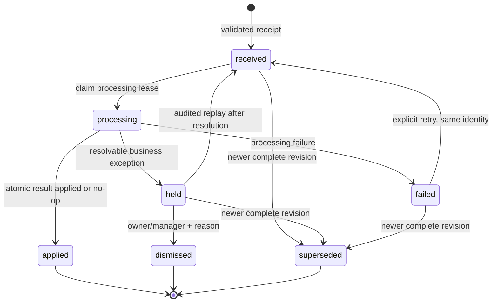

# M4: Provider-neutral sales ingestion

Status: accepted. Person A approved the consumption-port boundary, recipe-version assumptions, opening-count behavior, and correction ownership on 2026-09-19.

## Context and scope

[B1](../PANTRACK_MILESTONES.md#person-b--sales-ingestion-and-pos-sequence) specifies the event contract and state machine that future M4 receipt and application work will implement. This record does not change the current manual, CSV, or authenticated bridge request formats, and it does not add a schema, route, user interface, migration, or live integration. The current prototype behavior remains as described in [CURRENT_STATUS.md](../CURRENT_STATUS.md).

The boundary is provider-neutral: adapters authenticate a source, bind it to one company, and translate provider data into this contract. Provider-specific parsing and credentials do not enter inventory logic.

## Normalized event contract

The TypeScript shape below is the version 1 normalized contract. It describes validated internal data, not a public request body.

```ts
type SalesEventV1 = {
  schemaVersion: "pantrack.sales.v1";
  companyId: string; // derived by the server from the authenticated connection
  source: {
    kind: "manual" | "csv" | "bridge" | "native";
    provider: string;
    environment: string;
    connectionId: string;
    merchantId: string;
    locationId: string;
  };
  external: {
    externalEventId: string; // stable for the provider event across delivery channels
    externalOrderId: string; // groups the order's complete revisions
    revision: number; // positive safe integer, monotonic within the order
    eventIdempotencyKey: string; // computed by the server; never accepted from an adapter
  };
  eventType: "sale" | "revision" | "cancellation" | "refund" | "remake" | "reopen";
  orderStatus: "open" | "completed" | "canceled" | "partially_refunded" | "refunded" | "unknown";
  preparationStatus: "not_started" | "prepared" | "fulfilled" | "unknown";
  occurredAt: string; // ISO 8601 timestamp
  receivedAt: string; // server receipt time
  timeQuality: "provider" | "inferred";
  lines: Array<{
    externalLineId: string;
    externalItemId: string;
    externalVariationId?: string;
    quantity: string; // exact positive decimal; not a binary floating-point number
    modifiers: Array<{
      externalModifierLineId: string;
      externalModifierId: string;
      quantity: string; // exact positive decimal
    }>;
  }>;
  integrity: {
    sourcePayloadSha256: string;
    payloadExpiresAt: string | null;
    normalizedContractVersion: "pantrack.sales.v1";
  };
};
```

The server derives `companyId` from the authenticated, company-bound connection; an adapter may never select an arbitrary company. Provider, environment, connection, merchant, and location values are canonical opaque identifiers, not display names. The server computes `eventIdempotencyKey` from a length-delimited canonical encoding of `companyId`, provider, environment, merchant ID, external event ID, and revision. Concatenating unchecked strings is not sufficient.

`externalEventId` identifies the same provider event regardless of whether it arrives by webhook, polling, or retry. `externalOrderId` identifies the order lineage used for ordering and comparing revisions. Adapters must normalize two deliveries of the same provider revision to the same event ID. Within one company/provider/environment/merchant/order lineage, only one payload may claim a revision; a different event ID or payload for the same revision is an identity conflict. Revision values need not be contiguous, but they must be positive JavaScript-safe integers and must increase when the complete order representation changes.

Each event is a complete order revision, not a line-level patch. All consumption-affecting lines and modifiers in that revision form one atomic application unit. Line IDs must be unique within the event, and modifier-line IDs must be unique within their line. Native line and modifier-line identifiers must be stable across revisions. Legacy sources first sort lines by their canonical recipe or mapping identity and then derive deterministic synthetic identifiers from the source-namespaced batch reference and that stable index. Request order therefore cannot change identity. Decimal strings use a canonical non-exponent form with no leading plus sign or insignificant leading or trailing zeroes; A2 will set maximum scale and magnitude.

### Legacy source normalization

Existing request bodies do not acquire new fields. The server assigns the missing source identity deterministically:

| Existing path | Normalized source identity |
| --- | --- |
| Manual recipe quantities, including a recipe CSV loaded only into the browser preview | `kind=manual`, `provider=pantrack`, `environment=internal`, a company-scoped `legacy-manual` connection, `merchantId=companyId`, and reserved `locationId=default`. The server cannot distinguish the browser-only CSV preview from typed quantities, so both are manual. |
| Mapped register import, whether quantities were typed or loaded from the register CSV preview | `kind=csv`, `provider=pantrack-register-import`, `environment=internal`, a company-scoped `legacy-register-import` connection, `merchantId=companyId`, and reserved `locationId=mixed`. Each line's external item ID is the canonical tuple of its row provider, location, and item ID, preserving mixed-provider batches atomically. |
| Authenticated register bridge | `kind=bridge`, `provider=pantrack-register-bridge`, `environment=internal`, the stable server-side bridge connection ID, `merchantId=companyId`, and reserved `locationId=mixed`. Each line uses the same canonical provider/location/item tuple as mapped register imports. |
| Native adapter | `kind=native` and provider-issued environment, connection, merchant, location, order, event, line, and modifier identifiers normalized by that adapter. |

Reserved identifiers are versioned constants, never empty strings or user-facing labels. A legacy batch uses its source-namespaced reference for both external order and event identity and deterministic revision `1`.

## Identity, revisions, and duplicates

- An exact repeat of the same identity and source-payload hash returns the existing result. It may increment receipt telemetry, but it creates neither another event nor another processing attempt and cannot consume inventory again.
- The same event identity, or the same order revision, with a different payload hash is retained in a separate immutable conflict receipt linked to the canonical event. The conflict carries `identity_conflict` for owner/manager review but does not replace or transition the canonical event, including when that event is terminal.
- A newer complete revision may supersede an older revision only while the older revision is unapplied and in an allowed non-processing state.
- An applied event is immutable. It cannot be superseded, rewritten, or replayed for another deduction.
- An adapter without a native revision uses deterministic revision `1`. Receipt timestamps must not be used as event identity or revision.
- Manual, CSV, bridge, and native batch references occupy separate source namespaces, so identical legacy references cannot collide across sources.

Conflict receipts are not application events and never enter `processing`. Dismissing one requires an owner or manager, a nonempty reason, and an audit record. Exact duplicate receipts do not create conflict records.

## Receipt and application state machine



| From | To | Required condition and audit behavior |
| --- | --- | --- |
| `received` | `processing` | A worker obtains an exclusive, expiring lease and creates a new immutable application-attempt record. |
| `processing` | `applied` | The whole revision is atomically consumed once, or the policy calls for an applied no-op. The result is recorded on the attempt. |
| `processing` | `held` | A typed held reason prevents any line from applying. The attempt and reason are recorded. |
| `processing` | `failed` | A technical processing failure is recorded. An expired lease becomes `failed` with reason `interrupted`; expiry never implies application. |
| `failed` | `received` | An explicit retry reuses the same event identity and adds an audit record. A later processing claim creates a distinct attempt. |
| `held` | `received` | An owner or manager resolves the cause and initiates an audited replay. A later processing claim creates a distinct attempt. |
| `held` | `dismissed` | An owner or manager supplies a nonempty reason. Dismissal is audited. |
| `received`, `held`, or `failed` | `superseded` | A newer complete revision arrives before consumption. The superseding event is linked and the transition is audited. |

`applied`, `dismissed`, and `superseded` are terminal. A processing event must first reach `held` or `failed`; it is never superseded mid-attempt. Every application attempt is an immutable record. A duplicate receipt creates no attempt.

Processing is serialized per company/provider/environment/merchant/order lineage. When a newer revision arrives while an older revision is processing, the newer event remains `received` and cannot obtain a lease. If the older event becomes `held` or `failed`, it is atomically superseded before the newer event may process. If the older event becomes `applied`, the newer event is evaluated against that applied consumption snapshot. A lower revision arriving after a higher revision is recorded as terminal `superseded` without an application attempt. A second claimant for the same revision follows the identity-conflict rule above. These ordering checks and the processing lease must be committed transactionally so concurrent workers cannot apply two revisions out of order.

Held reasons are:

- `unknown_item`
- `unknown_variation`
- `unknown_modifier`
- `missing_recipe`
- `inactive_recipe`
- `invalid_quantity`
- `unit_mismatch`
- `before_opening_count`
- `ambiguous_preparation`
- `identity_conflict`
- `unsupported_revision`
- `correction_required`

Malformed, oversized, unauthenticated, or unmapped-company requests are rejected before an event is created. A structurally valid event bound to a known company is received and then held when its menu mapping or consumption data cannot be resolved.

## Consumption policy

For an order with prior applied consumption, the service compares the new complete revision with the latest applied consumption snapshot using stable line and modifier-line IDs. New prepared lines, new prepared modifiers, and quantity increases are positive deltas. Removed lines, removed modifiers, quantity decreases, or substitutions contain a negative/restorative delta. A revision containing any negative or unresolvable delta is held in full as `correction_required`, even if it also contains valid additions. An unchanged revision is an applied no-op. If there is no prior applied consumption and the complete revision has explicit prepared or fulfilled evidence, all prepared quantities are the positive delta.

| Event facts | Inventory result |
| --- | --- |
| Sale is prepared or fulfilled | Consume exactly once. |
| Order is completed but preparation is unknown | Hold the complete revision as `ambiguous_preparation`. |
| Cancellation is confirmed before preparation | Record an applied no-op. |
| Cancellation occurs after preparation and prior consumption exists | Record an applied no-op and retain consumption; never restore inventory automatically. |
| Cancellation is the first observed revision but contains a complete order with explicit preparation evidence | Consume the prepared snapshot once. If the evidence or snapshot is incomplete, hold as `ambiguous_preparation`. |
| Financial refund or partial refund has no separate preparation evidence | Record an applied no-op; financial status alone makes no inventory change. |
| Refund is the first observed revision and contains a complete order with explicit preparation evidence | Consume the prepared snapshot once. If only financial status is known, use the no-op rule above. |
| Remake has explicit preparation evidence and stable new line/modifier identities or quantity increases | Consume only the positive remake delta as additional usage. |
| Remake lacks preparation evidence | Hold as `ambiguous_preparation`. |
| Reopened order has an older, unapplied revision | The newer complete revision may supersede the older one. |
| Reopened order follows an applied event and has explicit prepared additions | Consume only the positive additions as additional usage under the newer event identity. |
| Reopened order has removals, substitutions, decreases, or another change requiring restoration | Hold the entire revision as `correction_required` for reviewed correction. |
| Any revision is ambiguous | Hold the entire revision; do not apply individually valid lines. |
| Event occurred before the relevant opening-count cutoff | Hold the entire revision as `before_opening_count`. |

An applied mistake is corrected only with a linked, audited compensating inventory adjustment. The original sales event, selected recipes, attempt, and consumption remain immutable.

## Payload retention and redaction

The service hashes the canonical received payload with SHA-256 before its unredacted form is discarded. It retains normalized identifiers, state history, hashes, attempts, resolutions, and audit records long term until M12 defines general retention.

For JSON sources, “canonical” means the validated provider object serialized as UTF-8 with object keys sorted recursively and JSON primitive values normalized. Array order is preserved except for schema-declared unordered collections: order lines and modifiers are sorted by their stable IDs before hashing. Transport signatures are verified against the original bytes before canonicalization. Whitespace, object-key order, or order-line presentation order alone therefore cannot produce an identity conflict. Non-JSON adapters must publish an equally deterministic canonicalization in their adapter contract. The hash is for integrity and conflict comparison; it is not an authentication credential.

A strictly allowlisted, redacted provider fragment may be retained for 30 days and is capped at 65,536 UTF-8 bytes per event. `payloadExpiresAt` records its deterministic deletion deadline for B3 and is `null` when no fragment is retained; M9 may later schedule cleanup. The allowlist excludes customer names, email addresses, telephone numbers, delivery addresses, payment data, tenders, tokens, cookies, authorization headers, and free-form notes unless a specific field has been reviewed and documented as essential to consumption. Redaction occurs before persistence or logging.

The authenticated bridge keeps its externally documented limit of 50,000 UTF-8 bytes. The prototype currently checks 50,000 JavaScript string code units; B2 must replace that approximation with a byte-bounded read and add ASCII and multibyte boundary tests. This security tightening changes no valid request under the documented byte limit. The transport limit is independent of the retained-fragment cap.

## Compatibility and cutover

- Manual entry, manual CSV, register CSV, and authenticated bridge request formats remain unchanged.
- Legacy inputs use server receipt time for `occurredAt` and set `timeQuality` to `inferred`. Native adapters must supply provider event time and use `provider` quality.
- Legacy batch references are source-namespaced before identity is computed. Canonically sorted recipe or mapping identities supply the stable indices used for synthetic line IDs.
- Existing `sales_imports` rows remain immutable legacy-applied history. There is no backfill or conversion.
- At the later B4 cutover, duplicate detection must consult legacy imports so an already applied reference cannot consume inventory through the new service.
- Until B4, existing imports keep their current behavior. B2 develops receipt and exception handling separately against a fake consumption port.

Using receipt time for a delayed legacy batch can place its inferred event time after an opening count that already included those sales. That limitation is preserved for compatibility until B4; operators must not use legacy imports for pre-count sales, and B4 compatibility tests must prove the cutoff and legacy-deduplication behavior before cutover.

## Authorization

The approved company permission matrix remains authoritative:

- Owners and managers may create manual or mapped imports, resolve and replay held events, dismiss with a reason, and initiate documented corrections.
- Only owners may create, replace, or revoke bridge/native integration credentials and connect or disconnect a POS.
- Company-bound machine credentials may receive events only for their bound company and connection. They cannot resolve, replay, dismiss, correct, or read unrelated company data.
- Employees may view non-sensitive event status but may not import sales or change event state.
- Anonymous users, wrong-company members, and forbidden roles are denied on the server. B2 and B4 must cover those cases with focused tests.

## A-to-B inventory handoff requiring approval

Person A is asked to approve this exact boundary before this decision changes to `accepted`.

The consumption-port input contains:

- server-derived company ID;
- an `applicationIdempotencyKey`, derived by the server from the event idempotency key plus the versioned operation name `inventory-consumption:v1`, that is stable for the event's logical inventory effect and reused across every retry or replay;
- event time and time quality;
- mapped base and modifier recipe IDs, not preselected recipe-version IDs;
- exact decimal line and modifier quantities; and
- actor and source metadata.

Every processing claim has a separate random `attemptId` used only for attempt history. It must never be sent as `applicationIdempotencyKey`; otherwise a retry could deduct twice.

The consumption port returns exactly one of:

```ts
type ConsumptionResult =
  | { kind: "applied"; inventoryMutationId: string; recipeVersionIds: string[] }
  | { kind: "duplicate"; inventoryMutationId: string; recipeVersionIds: string[] }
  | {
      kind: "not_applied";
      reason:
        | "missing_recipe"
        | "inactive_recipe"
        | "invalid_quantity"
        | "unit_mismatch"
        | "before_opening_count";
    };
```

Person B resolves external item, variation, and modifier mappings to logical recipe IDs and handles unknown mappings, preparation ambiguity, identity conflicts, unsupported revisions, and correction policy before calling the port. Person A selects the immutable recipe versions applicable at the event time and returns those selections with an applied or duplicate result. A typed `not_applied` result causes the whole event to be held with the matching reason. A thrown or unavailable-port error is technical failure and causes `failed`, never `applied`.

The port guarantees an atomic all-or-nothing deduction, exact decimal and unit validation, opening-count cutoff enforcement, immutable recipe-version selection, and no provider-specific behavior. It stores `applicationIdempotencyKey` with the inventory mutation atomically, so concurrent calls or later attempts return `duplicate` with the original mutation and recipe-version IDs.

Person B owns receipt, identity, external-to-recipe mapping, event states, retries, delta classification, and the held-event workflow. Person A owns recipe-version selection, decimal/unit validity, opening-count cutoff behavior, and atomic inventory mutation. The authorization rules above govern operator actions.

Approval must explicitly cover:

1. the consumption-port fields and typed results;
2. immutable recipe-version selection for the event time;
3. which opening count establishes the applicable cutoff; and
4. ownership of compensating corrections after an event has applied.

Approval recorded: Person A approved all four points above in the B1 implementation conversation on 2026-09-19. The merge owner, not this B1 task, updates the shared roadmap checkbox when the decision record is committed and the remaining required evidence exists.

## Consequences and next step

This design makes receipt durable and replayable without allowing provider ambiguity or partial line application to corrupt inventory. It also preserves legacy behavior during development, at the cost of maintaining a legacy duplicate check through the B4 cutover.

B2 is the next unblocked workstream-B task: contract-test and implement validation, durable receipt, redaction, states, and held-event behavior against a fake consumption port. Inventory application remains gated on the reviewed A2 contract and later B4 integration.
